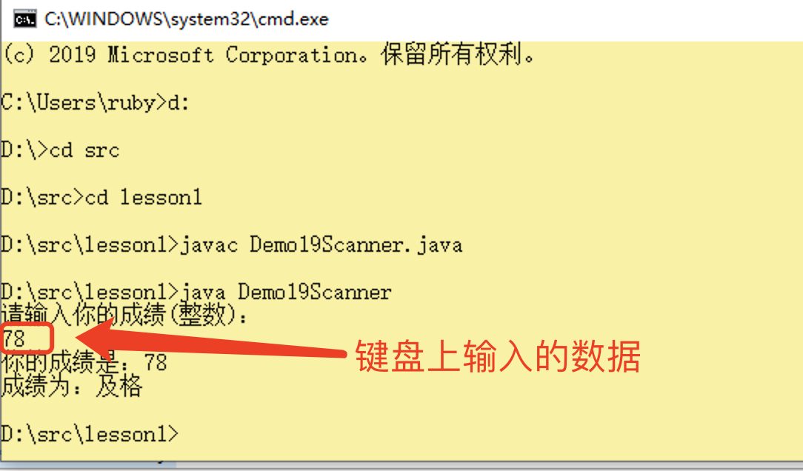
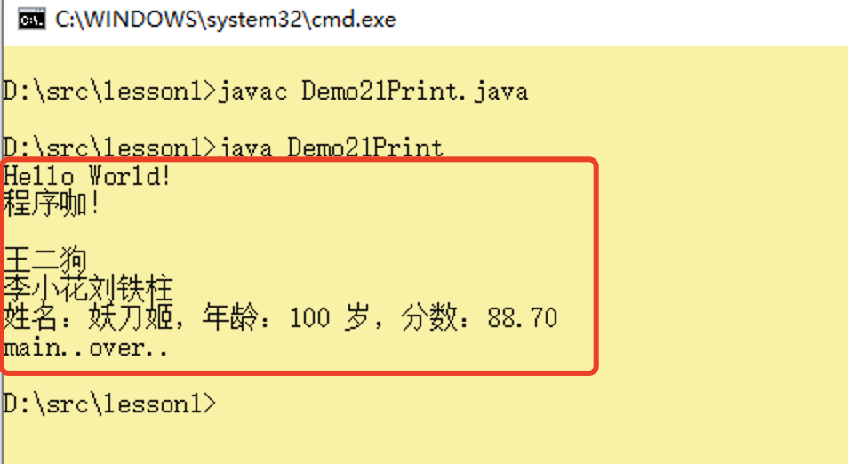
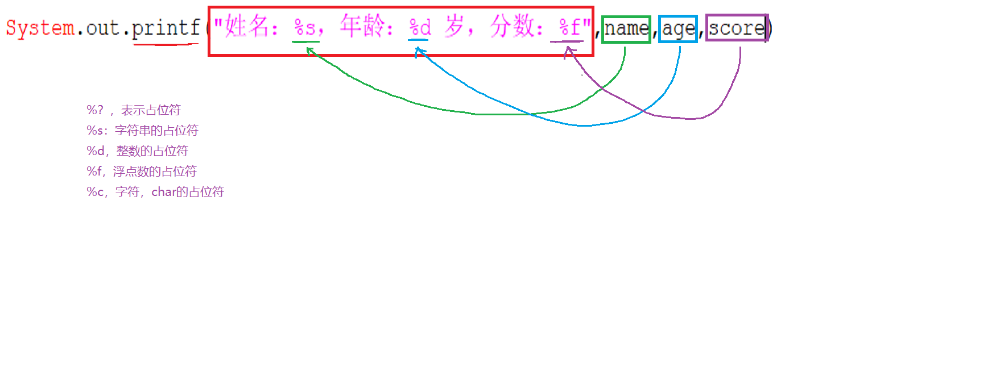

## Java中的键盘输入和打印输出

> 作者：韩茹
>
> 公司：程序咖（北京）科技有限公司
>
> 程序咖：IT职业技能评测平台
>
> 网址：https://www.chengxuka.com


任务

```
1.如何键盘输入数据
2.打印的方法
```


### 一、键盘输入

有的时候，我们需要从键盘上获取输入的数据，程序才能够继续向下执行。比如说设计一个程序，用于判断你的成绩是否及格，每个人的成绩都不同，我们可以选择键盘输入成绩，然后再进行判断及格与否。那么就需要学会使用键盘输入。

键盘输入的操作语法，在此处属于超纲范畴。因为涉及到导入包，创建对象，调用方法等。所以此处，仅要求大家能够学会使用即可。至于它的原理，学完面向对象，自然就理解了。


对于一个源文件的结构：

```java
//对于一个源文件的结构：

//第一行是：package的定义

package test;

//第二步：导入该程序需要的包

import xxx.xxx.xxx;

//第三步：类的声明

public class 类名{

	//第四步：main函数的定义：程序的入口

	pubic static void main(String[] args){
		//第五步：程序要执行 的代码
        
        //.....
	}

}

```

读取键盘的操作步骤：

```java
1.导入Scanner类
	import java.util.Scanner;
2.创建Scanner类的对象
	Scanner input = new Scanner(System.in);
3.读取键盘输入的数据
	这里要看你想获取哪种类型的键盘输入数据：
	input.nextDouble();//表示获取一个double类型的数据
	input.nextInt();//表示获取一个int类型的数据
	input.nextBoolean();//表示获取一个boolean类型的数据
	input.next();//表示获取一个字符串String
	。。。
```


示例代码：

```java
//step1：导入Scanner
import java.util.Scanner;//导入java.util包下Scanner这个类，那么在程序中就可以使用Scanenr。

public class Demo19Scanner
{
	public static void main(String[] args){
		//step2：创建一个扫描器对象，才可以读取键盘输入
		Scanner input = new Scanner(System.in);
		System.out.println("请输入你的成绩(整数)：");

		//step3：读取键盘输入的数据：
		int score = input.nextInt();//读取键盘上输入的一个整数
		
		System.out.println("你的成绩是：" + score);

		String msg = score >= 60? "及格" : "不及格";
		System.out.println("成绩为：" + msg);
	}
}
```

运行结果：




你还可以在键盘输入其他的数据类型：

```java
//1.导入Scanner
import java.util.Scanner;
public class Demo20Scanner 
{
	public static void main(String[] args) 
	{
		//2.创建Scanner扫描器
		Scanner input = new Scanner(System.in);


		//3.读取键盘输入的数据
		System.out.println("请输入一个小数：");
		double num1 = input.nextDouble();//读取键盘上输入的小数double类型的
		System.out.println("读取到的小数是：" + num1);

		

		System.out.println("请输入一个字符串：");
		String str = input.next();//读取键盘上输入的一个字符串
		System.out.println("接收到的字符串是：" + str);

		System.out.println("请输入一个字符：");
		char c = input.next().charAt(0);//读取键盘上输入的单个字符

		System.out.println(c);
		
	}
}

```

运行结果：


**<font color="red" size="5">踩坑：想要键盘输入哪种数据类型，就要调用相应的方法，在输入数据的时候，类型一定要匹配，否则会异常。</font>**


### 二、打印输出

我们都知道要想打印输出，使用`System.out.println();`语句即可。

但是还有一些其他的语句，也可以用于打印输出。

```
//1.print+line，打印后换行
System.out.println();//打印输出后换行
//2.print，只打印，不换行
System.out.print();//打印输出后不换行
//3.print+format，按照指定的格式进行打印
System.out.printf();//格式化打印输出
	%d，整数占位符
	%s，字符串占位符
	%f，浮点占位符
 		%.2f,%.3f
	%c，字符占位符
```

示例代码：

```java
public class Demo21Print 
{
	public static void main(String[] args) 
	{
		/*
		打印：System.out.xxxx()
		1、println();print + line ，打印后换行

		2、print();只是打印，不换行

		3、扩展内容：
			printf();print+format ，格式化打印
		*/

		System.out.println("Hello World!");//print + line ，打印后换行
		System.out.println("程序咖！");
		System.out.println();//只是换行
		System.out.println("王二狗");
		System.out.print("李小花");
		System.out.print("刘铁柱");

		System.out.println();

		String name = "妖刀姬";
		int age = 100;
		double score = 88.7;


		System.out.printf("姓名：%s，年龄：%d 岁，分数：%.2f\n",name,age,score);//占位符，使用一个符号，占着这个地儿
		System.out.println("main..over..");
	}
}

```

运行结果：



格式化打印原理：



